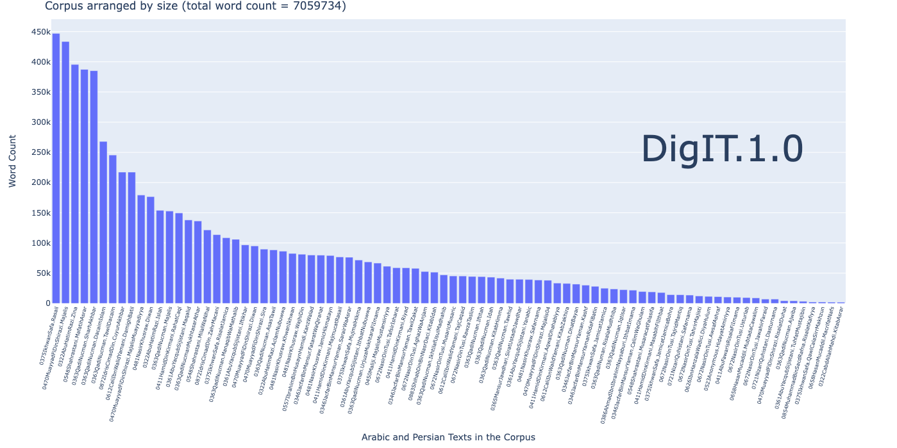

# Digital Ismaili Texts v.1.0

## Introduction

DigIT.1.0 is a bilingual corpus of Arabic and Persian texts, which will form the basis of a larger multilingual corpus of Ismaili texts.

The corpus is created and maintained by Aslisho Qurboniev, a researcher at the Institute of Ismaili Studies. The texts come from a variety of sources, such as from the OpenITI, but many will be digitised for the first time, including from manuscripts. The corpus follows the OpenITI standards and draws upon the tools created by the KITAB team. It is hoped that this corpus will become a useful research tool for students of Ismaili history and thought.

 The Corpus is still being developed, and new texts will be added as they become available. Your contribution will be welcome. 

 Please also note that this repository is currently private! You are free to use the texts in any way you wish, but please do not redistribute them without permission.

## The Corpus

The corpus contains texts in plain [mARkdown](https://kitab-project.org/corpus/markdown) format, organised into folders by author. Currently all texts by one author are in one folder, but later one each work will be nested in its own folder along with its metadata files, following OpenITI conventions. Further details can be found on the KITAB website (Documentation). For corpus approach to Islamicate texts peioneered by Maxim Romanov and the KITAB team, see the KITAB project and OpenITI website.

### How to use the DigIT.1.0 corpus

The textual files are in plain text format, so if you can read them in a text editor, you can use them. If you want to work with them in a more productive way, you can download the files and work with them in a text editor such as Kate Editor or EditPadPro.

The best place to start is the documentation provided for the OpenITI corpus on the KITAB project website. Read about [How to use the Corpus](https://kitab-project.org/corpus/use), [The URI structure](https://kitab-project.org/corpus/use#uri-structure) adopted by OpenITI, on [Metadata files](https://kitab-project.org/corpus/use#metadata-files). There is detailed guidelines about these and much more about technical aspects in the [Documentation](https://kitab-project.org/docs/openITI)

### Technical support and tools

See OpenITI [Documentation](https://kitab-project.org/docs/openITI)
* [On installing and working with GitHub and GitBash](https://kitab-project.org/docs/openITI#getting-started-with-github)
* [On recommended and supported software for working with text files](https://kitab-project.org/docs/openITI#5-software-versions-and-installation) 
* [On annotating texts](https://kitab-project.org/docs/openITI#5-software-versions-and-installation)

### Understanding the URIs

Folder structure: Author –> Texts 
URI: Unique Resource Identifier, which consists of Author ID, Book ID, version (edition) ID

Example of Version URI:

##### Author ID – Book ID – Version ID - extension

{Year of Death + author shuhra} {Book} {Digital Edition +language +version} {extension}
```
* 0363QadiNucman.IkhtilafUsulMadhahib.EScr20110913-ara1.txt
* 0346JacfarBinMansurYaman.TawilZakat.Kraken220315161331-ara1.txt
* 0481NasirKhusraw.Safarnama.Ganjoor-per1.txt
* 0721NizariQuhistani.Safarnama.Ganjoor-per1.txt
``` 

Here is a nice illustration of the URI structure from the KITAB website: 


For details, see [here](https://kitab-project.org/docs/openITI#uris--cts-like-folder-structure)

### A distant preview of the current corpus



